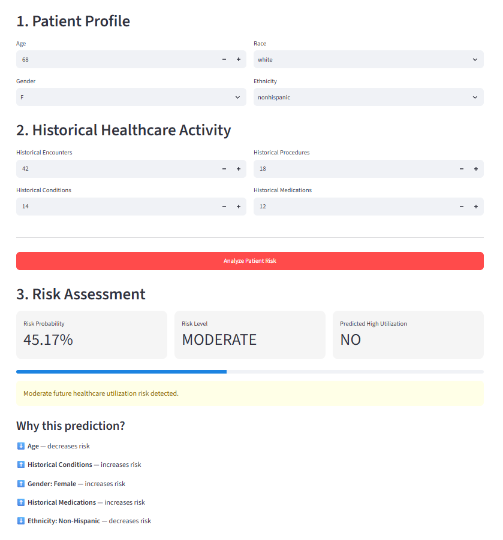
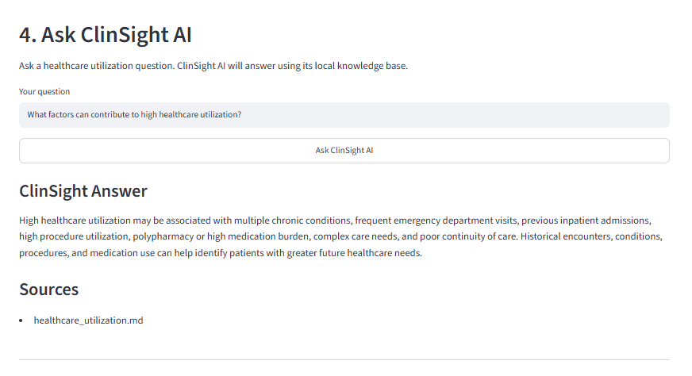
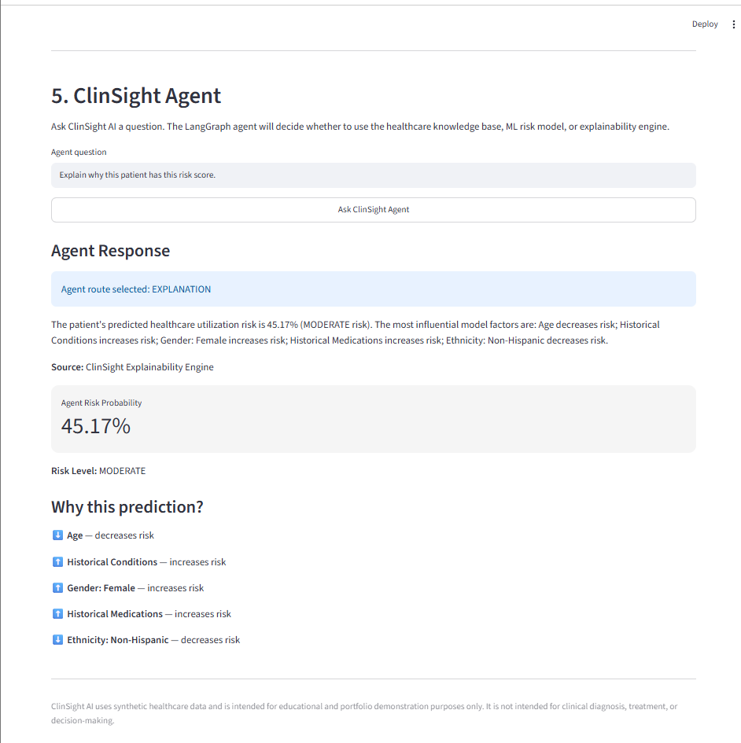

# 🏥 ClinSight AI

## Agentic Healthcare Intelligence Platform

**Predictive ML • Explainable AI • RAG • Agentic AI • Healthcare Safety**

ClinSight AI is an end-to-end healthcare AI platform that combines **machine learning, explainable AI, retrieval-augmented generation (RAG), agentic AI, safety guardrails, FastAPI, Streamlit, and Docker**.

The system analyzes synthetic patient history to estimate future healthcare utilization risk, explains individual predictions using SHAP, answers healthcare-utilization questions using a grounded local RAG pipeline, and uses LangGraph to route requests between prediction, explainability, knowledge retrieval, and safety workflows.

> **Disclaimer:** ClinSight AI uses synthetic healthcare data and is intended for educational, research, and portfolio demonstration purposes only. It is not intended for diagnosis, treatment recommendations, or clinical decision-making.

---

## 🚀 Key Features

- Healthcare utilization risk prediction
- Time-aware feature engineering to reduce future-data leakage
- Logistic Regression, Random Forest, and Gradient Boosting model comparison
- SHAP-based patient-level explainability
- Grounded Retrieval-Augmented Generation (RAG)
- SentenceTransformer semantic embeddings
- ChromaDB vector database
- Local Hugging Face FLAN-T5 generation
- LangGraph agent orchestration
- RAG, prediction, and explanation routing
- Healthcare safety guardrails
- FastAPI REST API
- Interactive Streamlit dashboard
- Custom agent integration evaluation
- Docker and Docker Compose containerization

---

# 🧠 System Architecture

```text
                         ClinSight AI
                              │
                      Streamlit Dashboard
                              │
                           FastAPI
                              │
                       LangGraph Agent
                              │
                       Safety Guardrail
                              │
             ┌────────────────┼────────────────┐
             │                │                │
             ▼                ▼                ▼
       Prediction Route  Explanation Route   RAG Route
             │                │                │
       Random Forest          SHAP             Query
             │                │                │
       Scikit-learn     Risk Explanation  SentenceTransformer
             │                                 │
             ▼                              Embedding
       Risk Prediction                         │
                                               ▼
                                            ChromaDB
                                               │
                                        Relevant Chunks
                                               │
                                           FLAN-T5
                                               │
                                               ▼
                                      Grounded Response
```

---

# 📊 Dataset

ClinSight AI uses **Synthea synthetic healthcare data**.

| Dataset | Records | Columns |
|---|---:|---:|
| Patients | 1,163 | 25 |
| Encounters | 61,459 | 15 |
| Conditions | 38,094 | 6 |
| Procedures | 83,823 | 9 |
| Medications | 56,430 | 13 |
| Claims | 117,889 | 31 |

The raw datasets are intentionally excluded from GitHub.

---

# 🔍 Exploratory Data Analysis

The EDA pipeline analyzes:

- Patient demographics
- Age distribution
- Gender distribution
- Race and ethnicity
- Healthcare expenses
- Encounter utilization
- Medical conditions
- Procedures
- Medication activity
- Claims activity
- Missing values
- Duplicate records

No duplicate rows were detected across the six source datasets during the initial quality assessment.

Primary notebook:

```text
notebooks/01_healthcare_data_exploration.ipynb
```

---

# ⚙️ Feature Engineering

Raw event-level healthcare records are aggregated into patient-level machine-learning features.

Historical features include:

```text
AGE
GENDER
RACE
ETHNICITY
HIST_TOTAL_ENCOUNTERS
HIST_TOTAL_CONDITIONS
HIST_TOTAL_PROCEDURES
HIST_TOTAL_MEDICATIONS
```

Final modeling cohort:

```text
1,163 patients × 17 columns
```

---

# ⏳ Temporal Prediction Design

ClinSight AI uses a time-aware modeling approach.

Historical healthcare activity is used as model input, while future healthcare utilization is used to construct the prediction target.

```text
HISTORICAL PERIOD
       │
       ├── Encounters
       ├── Conditions
       ├── Procedures
       └── Medications
       │
       ▼
Machine Learning Features

────────── Prediction Cutoff ──────────

       ▼
FUTURE PERIOD
       │
       ▼
Future Healthcare Utilization
```

This design helps reduce **data leakage**, where future information could otherwise influence model training.

---

# 🎯 Prediction Target

The model predicts whether a patient will become a **high future healthcare utilizer**.

The high-utilization threshold was defined using the upper quartile of future encounter activity:

```text
Threshold: > 12 future encounters
```

Class distribution:

```text
Lower utilization     896 patients   77.04%
High utilization      267 patients   22.96%
```

---

# 🤖 Machine Learning Models

Three classification algorithms were evaluated.

| Model | Accuracy | Precision | Recall | F1 | ROC-AUC |
|---|---:|---:|---:|---:|---:|
| Logistic Regression | 0.670 | 0.367 | 0.623 | 0.462 | 0.690 |
| Random Forest | 0.755 | 0.468 | 0.547 | **0.504** | **0.784** |
| Gradient Boosting | **0.794** | **0.558** | 0.453 | 0.500 | 0.781 |

### Selected Model

**Random Forest**

Random Forest was retained as the primary model because it provided the strongest overall balance of ROC-AUC, F1 score, recall, and nonlinear modeling capability.

---

# 🔧 Hyperparameter Tuning

Random Forest tuning used:

```text
RandomizedSearchCV
5-fold cross-validation
ROC-AUC optimization
```

| Model | Accuracy | Precision | Recall | F1 | ROC-AUC |
|---|---:|---:|---:|---:|---:|
| Random Forest — Baseline | 0.755 | 0.468 | 0.547 | 0.504 | 0.784 |
| Random Forest — Tuned | 0.734 | 0.435 | 0.566 | 0.492 | 0.783 |

Tuning slightly increased recall but did not improve overall held-out performance, so the baseline Random Forest was retained.

---

# 🔎 Explainable AI with SHAP

ClinSight AI uses **SHAP** to provide patient-specific explanations for model predictions.

Example output:

```text
Risk Probability: 41.05%
Risk Level: MODERATE

Historical Procedures       ↓ decreases risk
Historical Encounters       ↓ decreases risk
Gender: Female              ↑ increases risk
Historical Conditions       ↑ increases risk
Ethnicity: Non-Hispanic     ↓ decreases risk
```

> SHAP values explain model behavior and should not be interpreted as clinical causality.

---

# ⚡ FastAPI Backend

ClinSight AI exposes its ML, RAG, and agent capabilities through a FastAPI backend.

Current endpoints:

```text
GET   /
GET   /health
POST  /predict
POST  /rag/query
POST  /agent/query
```

Local Swagger documentation:

```text
http://127.0.0.1:8000/docs
```

---

# 🖥️ Streamlit Dashboard

The Streamlit application provides a unified interface for:

- Patient risk assessment
- Patient-specific SHAP explanations
- Grounded healthcare-utilization RAG
- LangGraph agent interactions

---

# 📸 ClinSight AI in Action

## 🎯 Patient Risk Assessment

ClinSight AI analyzes patient demographics and historical healthcare activity to estimate future healthcare utilization risk and display patient-specific SHAP risk drivers.



---

## 📚 Grounded Healthcare RAG

The RAG workflow retrieves relevant healthcare-utilization context using SentenceTransformer embeddings and ChromaDB. A local FLAN-T5 generation layer produces a grounded response with source attribution.



---

## 🧠 Agentic Explainability

The LangGraph-powered ClinSight Agent routes patient-specific explanation requests to the Explainability Engine and combines the ML prediction with SHAP-derived risk drivers.



---

# 📚 Retrieval-Augmented Generation

ClinSight AI includes a local RAG pipeline for grounded healthcare-utilization question answering.

```text
Healthcare Knowledge Documents
              │
              ▼
       Document Ingestion
              │
              ▼
         Text Chunking
              │
              ▼
SentenceTransformer Embeddings
              │
              ▼
           ChromaDB
              │
              ▼
      Semantic Retrieval
              │
              ▼
        Local FLAN-T5
              │
              ▼
   Grounded Answer + Source
```

## RAG Components

### Knowledge Base

```text
data/knowledge_base/
```

### Document Ingestion

```text
src/rag/ingest.py
```

### Chunking

```text
Chunk size:     500
Chunk overlap:  100
```

### Embedding Model

```text
sentence-transformers/all-MiniLM-L6-v2
```

### Vector Database

```text
ChromaDB
```

### Local Generator

```text
google/flan-t5-small
```

A grounded fallback is used when the small local model produces an excessively short answer. The fallback is constructed only from information present in retrieved knowledge-base context.

---

# 🔎 Semantic Retrieval Example

Question:

```text
What factors can contribute to high healthcare utilization?
```

Example grounded answer:

```text
High healthcare utilization may be associated with multiple chronic
conditions, frequent emergency department visits, previous inpatient
admissions, high procedure utilization, polypharmacy or high medication
burden, complex care needs, and poor continuity of care.
```

Source:

```text
healthcare_utilization.md
```

---

# 🧠 LangGraph Agent

ClinSight AI uses **LangGraph** to orchestrate multiple AI capabilities.

```text
User Request
     │
     ▼
Safety Check
     │
     ▼
LangGraph Router
     │
 ┌───┼───────────────────┐
 │   │                   │
 ▼   ▼                   ▼
RAG  Prediction      Explanation
 │       │                │
 ▼       ▼                ▼
KB      Random           SHAP
+       Forest           Engine
FLAN-T5  Model
 │       │                │
 └───────┴────────┬───────┘
                  ▼
           Unified Response
```

The agent can route requests to:

- **RAG** — healthcare-utilization knowledge questions
- **Prediction** — patient utilization-risk scoring
- **Explanation** — patient-specific SHAP explanations
- **Safety Guardrail** — disallowed clinical advice

---

# 🛡️ Healthcare Safety Guardrails

ClinSight AI includes a safety layer designed to block requests for direct clinical advice.

The safety layer blocks requests involving:

- Diagnosis
- Prescriptions
- Medication selection
- Medication changes
- Dosage recommendations
- Treatment instructions

Example blocked request:

```text
What medication should I take for high healthcare utilization?
```

Example response:

```text
ClinSight AI does not provide diagnosis, prescriptions,
medication changes, or treatment advice.
Please consult a qualified healthcare professional.
```

---

# ✅ Agent Evaluation

ClinSight AI includes a custom integration evaluation suite that validates the behavior of the agentic AI workflow across key system capabilities.

The evaluation covers:

- Agent routing behavior
- Healthcare safety guardrails
- RAG grounding and source attribution
- ML prediction workflow
- SHAP explainability workflow

### Current Test Results

```text
Routing tests:       3/3 passed
Safety tests:        4/4 passed
RAG grounding:       1/1 passed
Prediction test:     1/1 passed
Explanation test:    1/1 passed

Total:              10/10 integration tests passed
```

All currently defined integration test cases pass successfully.

> These results represent the project's current 10-case integration test suite and validate expected behavior for predefined scenarios. They should not be interpreted as a measure of clinical accuracy, universal AI safety, or production-level reliability.

Evaluation code:

```text
src/evaluation/agent.py
```

---

# 🧰 Technology Stack

### Data & Machine Learning

**Python • Pandas • NumPy • Scikit-learn • Joblib**

### Machine Learning Models

**Logistic Regression • Random Forest • Gradient Boosting**

### Explainable AI

**SHAP**

### Generative AI / RAG

**Hugging Face Transformers • FLAN-T5 • SentenceTransformers • ChromaDB • LangChain Text Splitters**

### Agentic AI

**LangGraph**

### Backend

**FastAPI • Pydantic • Uvicorn**

### Frontend

**Streamlit • Requests**

### Engineering

**Git • GitHub • Docker • Docker Compose • Jupyter Notebook • VS Code**

---

# 📁 Project Structure

```text
clinsight-ai/
│
├── data/
│   ├── knowledge_base/
│   │   └── healthcare_utilization.md
│   ├── raw/                    # ignored by Git
│   ├── processed/
│   ├── synthetic/
│   └── chroma_db/              # generated locally
│
├── docs/
│   └── screenshots/
│       ├── risk-assessment.png
│       ├── rag-answer.png
│       └── agent-explanation.png
│
├── frontend/
│   └── app.py
│
├── models/
│
├── notebooks/
│   └── 01_healthcare_data_exploration.ipynb
│
├── src/
│   ├── agents/
│   │   └── clinsight_agent.py
│   ├── api/
│   │   └── main.py
│   ├── evaluation/
│   │   └── agent.py
│   ├── features/
│   ├── ingestion/
│   ├── models/
│   ├── preprocessing/
│   └── rag/
│       ├── ingest.py
│       ├── retriever.py
│       └── generator.py
│
├── tests/
├── Dockerfile
├── compose.yaml
├── .dockerignore
├── .env.example
├── .gitignore
├── LICENSE
├── requirements.txt
├── requirements-docker.txt
└── README.md
```

---

# 💻 Local Setup

## 1. Clone the Repository

```bash
git clone https://github.com/spoorthiigowdaa-unt/clinsight-ai.git
cd clinsight-ai
```

## 2. Create a Virtual Environment

```bash
python -m venv .venv
```

Windows PowerShell:

```powershell
.\.venv\Scripts\Activate.ps1
```

## 3. Install Dependencies

```bash
pip install -r requirements.txt
```

---

# 📚 Build the RAG Vector Store

Run:

```bash
python -m src.rag.retriever
```

---

# ⚡ Start FastAPI

Run:

```bash
python -m uvicorn src.api.main:app --reload
```

Open:

```text
http://127.0.0.1:8000/docs
```

---

# 🖥️ Start Streamlit

In another terminal:

```bash
python -m streamlit run frontend/app.py
```

Open:

```text
http://localhost:8501
```

---

# 🧪 Run Agent Evaluation

Run:

```bash
python -m src.evaluation.agent
```

Current documented result:

```text
10/10 integration tests passed
```

---

# 🐳 Docker

ClinSight AI runs locally as a two-service Docker Compose application.

Build and start:

```bash
docker compose up --build
```

Or start in detached mode:

```bash
docker compose up -d
```

Services:

```text
clinsight-api        → FastAPI   → port 8000
clinsight-dashboard  → Streamlit → port 8501
```

Verify:

```bash
docker compose ps
```

Local URLs:

```text
FastAPI Swagger:   http://localhost:8000/docs
FastAPI Health:    http://localhost:8000/health
Streamlit UI:      http://localhost:8501
```

The Dockerized FastAPI and Streamlit services have been locally validated, including dashboard-to-API communication and ML inference.

> **Deployment note:** The complete application is currently demonstrated locally through Docker Compose. Public cloud deployment is not required to run or evaluate the project.

---

# 🔐 Security

Sensitive and generated local files are excluded from Git, including:

```text
.env
.venv/
data/raw/
data/chroma_db/
```

Never commit API keys, credentials, real patient data, or local environment files.

---

# 🗺️ Roadmap

Future improvements include:

- Expanded healthcare knowledge base
- Stronger local instruction model
- Advanced RAG evaluation
- Retrieval relevance scoring
- Citation-level grounding evaluation
- Claims anomaly detection
- FHIR R4 ingestion and analytics
- FHIR-aware RAG
- MLflow experiment tracking
- Model monitoring and drift detection
- Redis-based caching
- PostgreSQL persistence
- Authentication and RBAC
- Expanded LangGraph workflows
- Human-in-the-loop review
- Cloud deployment
- CI/CD with GitHub Actions
- Automated unit and integration testing
- Healthcare fairness and subgroup evaluation

---

# 🎯 Project Goal

ClinSight AI demonstrates an end-to-end healthcare AI workflow spanning **machine learning, generative AI, RAG, agentic AI, explainability, backend engineering, containerization, safety, and evaluation**.

The project is designed to demonstrate how predictive ML and generative AI components can be integrated into a single modular application while maintaining source grounding, explainability, and healthcare-specific safety boundaries.

---

## 👩‍💻 Author

**Spoorthi Hassan Sathyanarayana**

GitHub: `spoorthiigowdaa-unt`

---

## ⚠️ Responsible AI Disclaimer

ClinSight AI uses synthetic data and is intended solely for educational, research, and portfolio demonstration purposes.

The system does not provide medical diagnosis, prescriptions, treatment recommendations, or clinical decision support. Predictions and generated responses should not be used for real-world healthcare decisions.